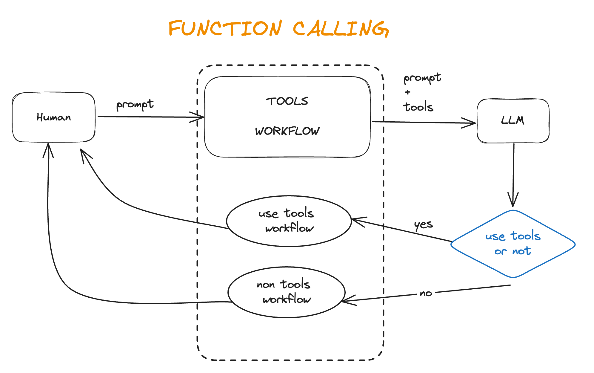

# Function calling 


## 1. 实现流程


## 2.环境安装
```
openai==0.28.1
streamlit==1.37.0

配置.env环境变量，将.env_sample重命命成.env
OPENAI_API_KEY=
```

## 3. 项目执行
1. 终端
```
python app.py
```

2. 网页
```
streamlit run stapp.py
```

## 4. 参考链接
[openai官方示例](https://platform.openai.com/docs/guides/function-calling)

[火山方舟官方文档](https://www.volcengine.com/docs/82379/1262342)